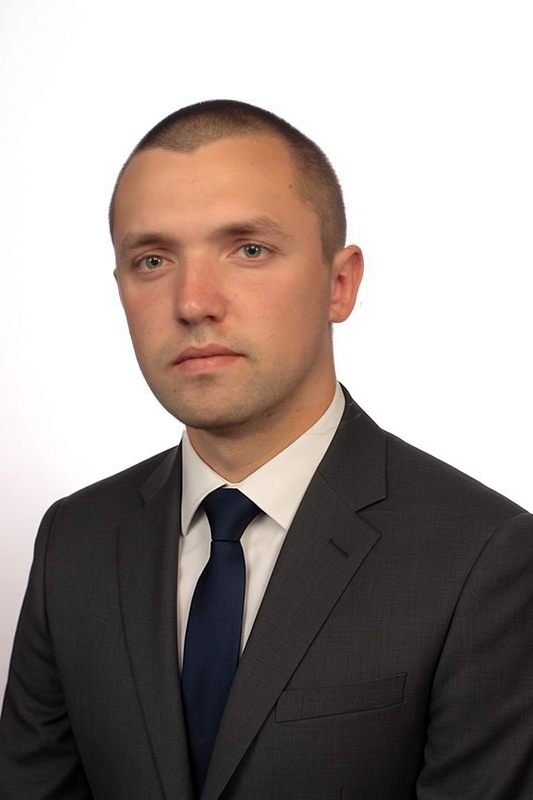

# Witaj w moim portfolio

  

    <h3>Data Scientist | AI Developer | ML Engineer</h3>

    

    Cześć! Nazywam się Michał Borek.

  Przez ponad 15 lat moją codziennością była precyzja laboratoriów przemysłowych i rygor kontroli jakości. Tam nauczyłem się, że jeden detal potrafi zmienić wynik całego procesu. Dziś tę inżynierską skrupulatność przenoszę do świata cyfrowego.

  Zamieniłem aparaturę pomiarową na Pythona, a fizyczne próbki na zbiory danych. Fascynuje mnie moment, w którym surowe tabele zaczynają "mówić", odkrywając ukryte wzorce i zależności. To portfolio jest zapisem mojej transformacji w stronę Data Science i Uczenia Maszynowego.

  Znajdziesz tu projekty, w których łączę analityczny umysł inżyniera z nowoczesnymi algorytmami, by rozwiązywać techniczne i biznesowe problemy. Rozgość się!

    

  

  

    
  

„Hobbystyczne programowanie to dla mnie połączenie pasji z pożytecznym. Tworzę aplikacje, które realnie ułatwiają życie i automatyzują codzienne czynności. Praca nad własnymi narzędziami daje mi satysfakcję, a jednocześnie jest najskuteczniejszym sposobem na ciągłe podnoszenie moich kwalifikacji w świecie IT.”

---

### :hammer_and_wrench: Mój Stack Technologiczny

Nie jestem teoretykiem. Tworzę aplikacje, które działają. Oto narzędzia, których używam na co dzień:

| Obszar | Technologie i Narzędzia |
| :--- | :--- |
| **Programowanie** | **Python** (średnio zaawansowany), SQL (podstawy) |
| **Data Science & ML** | Pandas, NumPy, Scikit-learn, **CatBoost**, PyCaret, Matplotlib, Seaborn |
| **Generative AI (LLM)** | **OpenAI API**, LangChain, Whisper (STT), QDrant (Vector DB), Langfuse |
| **Web Development** | **Streamlit** (budowa interaktywnych aplikacji MVP) |
| **Narzędzia** | Git, Docker, Excel (zaawansowany), Digital Ocean |

---

### :handshake: Co wnoszę do zespołu? (Moja przewaga)

Jako osoba, która zmienia branżę (Career Switcher), oferuję unikalne połączenie umiejętności "twardych" i "miękkich":

* :white_check_mark: **Inżynierska precyzja:** 15 lat pracy z normami i kontrolą jakości wyrobiło we mnie nawyk dbania o czystość danych i weryfikację wyników.
* :chart_with_upwards_trend: **Rozumienie biznesu:** Wiem, że model ML nie jest celem samym w sobie – ma rozwiązywać konkretny problem i przynosić wartość (ROI).
* :busts_in_silhouette: **Doświadczenie w zarządzaniu:** Jako były kierownik działu potrafię zarządzać projektami, brać odpowiedzialność za zadania i efektywnie komunikować się z zespołem.

---

### :mortar_board: Edukacja i Certyfikaty
Ciągły rozwój to moja codzienność. Oprócz wykształcenia technicznego, potwierdzam swoje umiejętności certyfikatami:

:student: **Wykształcenie:** Magister Inżynier Inżynierii Środowiska

:scroll: **Certyfikaty:** 

* **Kurs "Od zera do AI"** (Intensywny bootcamp Data Science & AI)
* **SQL dla prawdziwie początkujących** (Udemy)
* **Excel – praktyczny niezbędnik Analityka** (Udemy)
* **Certyfikaty branżowe:** Audytor wewnętrzny ISO 9001/14001/45001, Technolog CNC, Programista CAM (TÜV Rheinland)

---